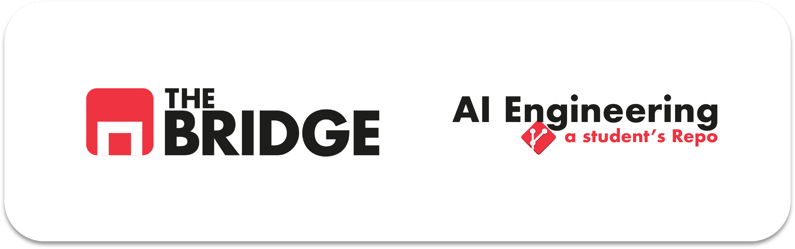

# The Bridge - Bootcamp AI Engineering



## Cómo está organizado este repo

Este repositorio está organizado siguiendo la filosofía de ***"sprints"*** que llevamos durante el curso. Por tanto habrá una carpeta por cada *sprint*, y en ella habrá subidos al repositorio las soluciones a los ejercicios propuestos por la organización del [Bootcamp de AI Engineering](https://thebridge.tech/bootcamps/data-science-con-ia/).

En el mismo, por cada *sprint* se detalla el log de ejercicios en los que se ha trabajado, para mostrar rápidamente aquellos cumplimentados ya finalizados y/o aquellos que están en marcha, todavía en progreso para su finalización.

## Log de cambios`:`

[archivados](##Archivo del los de cambios)

✅ **[08/06]** - Resuelta y entregada la [práctica obligatoria](https://github.com/hglebredo/bootcamp_AI_Engineering/blob/main/Sprint_02/Unidad_01_Python_II_Colecciones_Funciones/04_Practica_Obligatoria/18_Practica_Obligatoria_Colecciones_Funciones.ipynb) de la *"Unidad 1 - Python II Colecc. Func."*, también algunos de los ejercicios de la unidad. 
👉 **[09/06]** He retocado el final del código del ejercicio 10 para garantizar la salida del programa.  
♦️ **[09/06]** - Actualmente revisando contenidos pendientes...  

### MÓDULO 1 - Python + IA Generativa  

#### ➡️ [Sprint 01 - Python Basics (unidades didácticas 01 a 03)](https://github.com/hglebredo/bootcamp_AI_Engineering/tree/main/sprint_01)  

> [Unidad 01 - Introducción a Herramientas](https://github.com/hglebredo/bootcamp_AI_Engineering/tree/main/sprint_01/unit_01)  
[Unidad 02 - Python Basics I](https://github.com/hglebredo/bootcamp_AI_Engineering/tree/main/sprint_01/unit_02)  
[Unidad 03 - Bucles como estructuras de control](https://github.com/hglebredo/bootcamp_AI_Engineering/tree/main/sprint_01/unit_03)  


## Archivo del log de cambios

```
[anteriores a 08/06]
> Resueltos los ejercicios de práctica obligatoria de la *"Unidad 01"* referentes a [Markdown](https://www.markdownguide.org/basic-syntax/).  
>  Resueltos los ejercicios de práctica obligatoria de la *"Unidad 02"* referentes a Introducción al lenguaje Python.  
> Materiales de apoyo en linea sobre [manejo de cadenas](https://docs.python.org/2.5/lib/string-methods.html) y [arrays de datos](https://www.w3schools.com/python/python_ref_list.asp).  
>  Resueltos los ejercicios extra de la *"Unidad 03"* referentes a bucles y estructuras de control.  

``` 